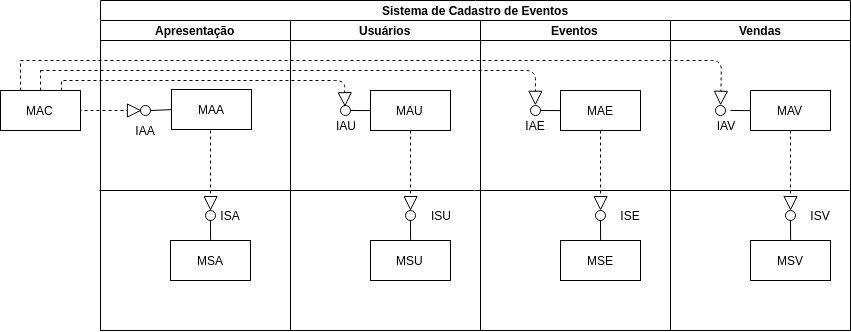
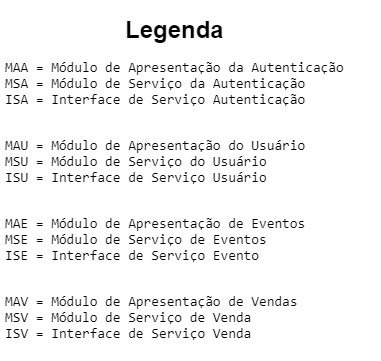

# Arquitetura do Sistema de Cadastro de Eventos

## Pedro Augusto Ramalho Duarte - 17/0163717
## Waliff Cordeiro Bandeira - 17/0115810





## Interfaces

Para a especificação das interfaces foram utilizados trechos da especificação para melhor apresentar e explicar as
funcionalidades das interfaces. Para as funcionalidades que é necessário que o usuário esteja logado ou e que verifique
que o mesmo pode utilizar a funcionalidade é passado via parâmetro o objeto CPF que funciona como chave primária do usuário

## Apresentação de Autenticação

Formulário para login

```
bool executar(CPF&)

void setModelAutenticacao(ISAutenticacao *modelAutenticacao)
```
## Apresentação de Usuário

Mostrar informações do usuário/ Forms para cadastro

```
void executar(CPF &cpf);

void setModelUsuario(ISUsuario *modelUsuario)
```
## Apresentação de Eventos

Um usuário que fez ou não login pode ver os eventos
```
void executar(CPF cpf) Erro

void setModelEventos(ISEventos *modelEventos)
```

## Apresentação de Vendas

Lista as compras já feitas pelo o usuário


```
void executar(CPF cpf) Erro

void setModelVendas(ISVendas *modelVendas)
```


## Serviço de Usuário

Para se cadastrar, precisa informar CPF, senha e os seguintes dados sobre o seu cartão de crédito: número, código
de segurança e data de validade.

```
void cadastrarUsuario(Usuario usuario, CartaoDeCredito cartaoDeCredito);

void mostrarUsuario(CPF cpf, Usuario *usuario, CartaoDeCredito *cartaoDeCredito);

bool excluirUsuario(CPF cpf);
```
## Serviço de Autenticação

Verificar no banco de dados se a senha confere

```
bool autenticar(CPF cpf, Senha senha)
```

## Serviço de Eventos

Uma vez autenticado, o usuário também tem acesso aos seguintes
serviços providos pelo sistema: cadastrar, descadastrar e alterar
evento.

Qualquer usuário do sistema pode obter dados sobre os eventos programados. Para acessar esses dados, o usuário deve prover os
seguintes dados quando de uma consulta: datas de início e término de período, nome da cidade e sigla do estado no qual
ocorrerá o evento.
```
bool criarEvento(CPF cpf, Evento evento, list<Apresentacao> listaApresentacao);

void alterarEvento(CPF cpf, Evento evento);

bool descadastrarEvento(CPF cpf, CodigoDeEvento codigo);

void pesquisarEventos(list<Evento> &listaEventos, Data dataInicio, Data dataTermino, Cidade cidade, Estado estado);

void meusEventos(list<Evento> &listaEventos, CPF cpf);

void mostrarApresentacao(list<Apresentacao> &listaApresentacao, CodigoDeEvento codigoDeEvento);
```


## Serviço de Vendas

Para adquirir ingressos, o usuário deve informar o código da
apresentação e a quantidade de ingressos desejada.

```
void listarApresentacao(list<CodigoDeApresentacao> &listCodigosApr);

void listarEventos(list<CodigoDeEvento> &listCodigoEve, CPF cpf);

bool adquirirIngresso(CPF cpf, CodigoDeApresentacao codigo, int quantidade);

void vendasDoEvento(CodigoDeEvento codigoDeEvento, list<pair<CodigoDeApresentacao, int>> &tabelaQtdIngressos);

void vendasPorCpf(CodigoDeApresentacao codigoDeApresentacao, list<pair<CPF, int>> &tabelaCpfIngressos);
```


